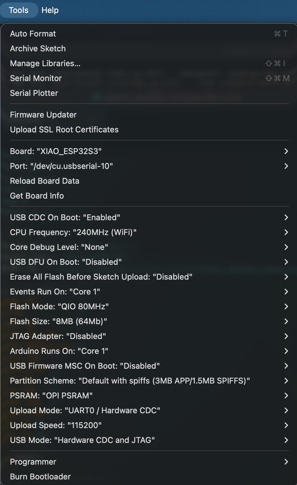

# reterminal_weather_news Arduino App

天気情報とニュースを表示する Arduino アプリ。

このアプリは、 Seeed Studio から発売されている [reTerminal E1002reTerminal E1002](https://wiki.seeedstudio.com/ja/getting_started_with_reterminal_e1002/) での使用を想定しています。

## Requirements

- [Arduino IDE](https://www.arduino.cc/en/software)

- [reTerminal E1002](https://wiki.seeedstudio.com/ja/getting_started_with_reterminal_e1002/)

## Usage

### Setup

### Install ESP32 Board in Arduino IDE and Install Libraries

公式ドキュメントの手順に従い、Arduino IDE に ESP32 ボードをインストールと、必要なライブラリをインストールしてください。

https://wiki.seeedstudio.com/ja/reterminal_e10xx_with_arduino/

### Configure WiFi and Server Settings

[sketch.ino](./sketch/sketch.ino) ファイルを開き、以下の設定を行ってください。

```cpp
// WiFi Settings
const char* WIFI_SSID = "your_ssid_here";
const char* WIFI_PASS = "your_password_here";
```

### Configure Web App Server Settings

[sketch.ino](./sketch/sketch.ino) ファイルを開き、以下の設定を行ってください。

デフォルトは、 `https://momijinn.github.io/reterminal_weather_news/screenshot.bmp` になっています。

```cpp
// Server Settings
const char* BMP_URL = "http://your_server_address_here/weather_news";
```

### Upload the Sketch

Arduino IDE を使用して、reTerminal E1002 にスケッチをアップロードしてください。

アップロードする際、Tool 設定は以下のように設定してください。

| tool 設定                                    |
| -------------------------------------------- |
|  |

そして、ボーレートは `115200` に設定してください。
