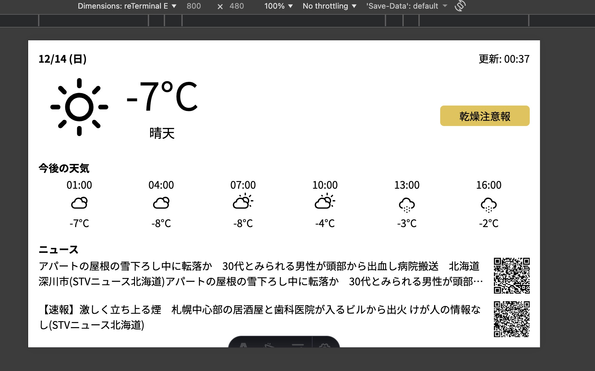

# reterminal_weather_news Web App

天気情報とニュースを表示する Web アプリ。

このアプリは、 Seeed Studio から発売されている [reTerminal E1002reTerminal E1002](https://wiki.seeedstudio.com/ja/getting_started_with_reterminal_e1002/) での使用を想定しています。

## Requirements

- [mise](https://mise.jdx.dev/)

- [OpenWeatherMap API Key](https://openweathermap.org/api)

## Usage

### Setup

#### Get OpenWeatherMap API Key

OpenWeatherMapのアカウントを作成し、API Keyを取得してください。

#### Get latitude and longitude

取得したい場所の緯度(latitude)と経度(longitude)を調べてください。

OpenWeatherMapの[Geocoding API](https://openweathermap.org/api/geocoding-api)を使用すると便利です。

```bash
# 東京の緯度・経度を取得する例
curl "http://api.openweathermap.org/geo/1.0/direct?q=Tokyo&limit=1&appid=your_api_key_here"
```

#### Create .env file

**web**フォルダ に `.env` ファイルを作成し、以下の内容を記述してください。

```env
OWM_API_KEY=your_api_key_here
OWM_LAT=city_latitude_here
OWM_LON=city_longitude_here
```

### Run the app

```bash
# web フォルダで実行
npm install
npm run dev
```

アプリが `http://localhost:3000` で起動します。

devtool などで画面サイズを 800x480 に設定して表示を確認してください。

| 画面イメージ                                      |
| ------------------------------------------------- |
|  |

### Using mock data for development

msw (Mock Service Worker) を使用して、天気情報とニュースのモックデータを返すことができます。

[./src/mocks/handlers.ts](./src/mocks/handlers.ts) を編集して、モックデータを変更できます。

変更後、 以下のコマンドでアプリを起動してください。

```bash
# web フォルダで実行
npm run internal
```

### Build for production

ビルドは以下のコマンドで行います。

```bash
# web フォルダで実行
npm run build
```
